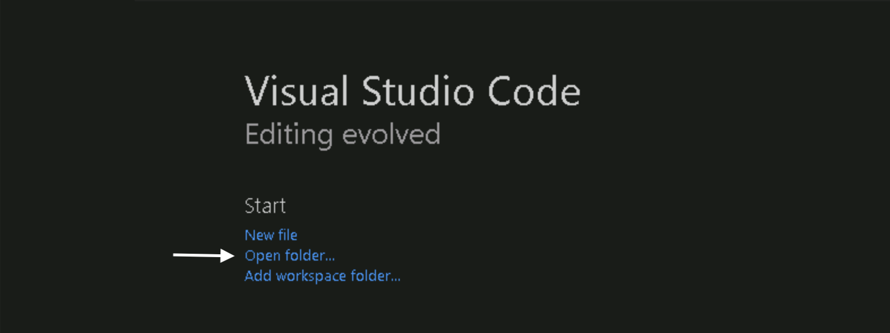

# Devops Playground #26: Hands on with Cypress 


# Introduction
On this meetup, we will walk you through what Cypress is and how it's different from existing test automation tools such as Selenium. We'll show you how to setup Cypress in your machines and write your first Cypress test.

Name: Marie Cruz

Role: QA and Continuous Delivery Consultant

Email: marie.cruz@ecs-digital.co.uk

LinkedIn: [Let's connect](https://www.linkedin.com/in/marie-desiree-cruz-95841242/)

# Agenda

- [Overview](#overview)
- [Requirements](#requirements)
- [Setup](#setup)
- [Cypress Setup](#cypress-project-setup)
- [Selector Playground](#selector-playground)
- [Writing Tests](#writing-tests)
  - [Cheat Sheet](#cheat-sheet)
  - [Scenario 1](#scenario-1)
  - [Scenario 2](#scenario-2)
  - [Scenario 3](#scenario-3)
- [Cypress CLI Commands](#cypress-cli-commands)
- [Further Reading](#further-reading)

## Overview

Cypress is a test automation tool created by Brian Mann to help developers write automation tests from a user’s perspective. Cypress is written purely in JavaScript and was created to address all the issues developers face when writing tests. Let's admit it, developers hate writing tests! From setting up the framework, debugging why the test is flaky, and dealing with the complexities of managing tests, it's no wonder why most developers prefer to put E2E tests on the side. 


## Requirements
- Node and NPM installed
- Code editor (e.g. VSCode)
- Chrome browser
- Basic Javascript knowledge

## Setup
The remote machine (connection details to be shared) will have all the programs you need to follow this session. For any technical assistance, please ask around for help.

## Cypress Project Setup
Once you are succesfully logged in to your instance, follow the steps below to setup Cypress.

1. On your desktop, click Visual Studio Code
2. Click on Open Folder



3. Navigate to this folder `C:/Users/ecs_user/cypressProject/devopsplayground-26-cypress` and click Select folder


4. Once the project is loaded on Visual Studio, let's open up the terminal to run some commands.


5. On the terminal, let's start up the sample application that we are testing today by typing in:
```
npm run start
```

Once the application is booted, it can be accessed by navigating to `http://localhost:3000/`


6. To verify if Cypress has been installed correctly, let's go back to Visual Studio Code and open up a new terminal.


On the new terminal, type in:

```
npx cypress verify
```

You should see a message that Cypress is verified and ready to use.

7. To open Cypress, type in the below command:
```
npx cypress open
```

You should then see the Cypress Test Runner up and running with 2 spec files.


If you click one of the spec files, Cypress will display the tests available as well as the application under test.


## Selector Playground
The selector playground is a feature provided by Cypress as part of the test runner. This helps you find the selector for the element that you wish to test. To use this feature, simply click on 
 and hover on an element. Cypress will provide you with the selector to use.


## Writing Tests
Since this is a hands on session, I have included the Cypress commands that we will use with an explanation of what it do. Please refer to below table as much as you need.

### Cheat Sheet

| API Command      | Description              | Example |
| -------------    | ---------------------    | -----   |
| cy.visit(url)  | Visits a url. When you add the property `baseUrl` on `cypress.json`, Cypress will take this as your base url.   | cy.visit('http://localhost:3000') or cy.visit('/register.html')|
| cy.get(selector)  | Gets the DOM element by its selector. An A DOM element object represents an HTMl element like div, button, img  | cy.get('#username') or cy.get('.categories > ul > li') |
| .type('value to type') | Types value into a DOM element | cy.get('#username).type('user1') |
| .click() | Clicks on a DOM element | cy.get('.submitBtn').click() |
| .should(chainers) or .should(chainers, value) | Creates an assertion against an element | cy.get('.submitBtn').should('be.visible') or cy.get('.categories > ul > li).should('have.length', 3) |

For full description on how to use the Cypress API, refer to this [documentation](https://docs.cypress.io/api/api/table-of-contents.html)

### Scenario 1
For our first test scenario, let's validate that the header is displaying correctly. Going back to Visual Studio code, click on `cypress/integration/image.gallery.spec.js`


Let's switch back to the Cypress test runner. By using the [selector playground](#selector-playground) feature, hover on the title and it should give you `#title` as its selector. For the icons list selector, let's use `.icons ul li`. Using some of the commands on [Cheat sheet](#cheat-sheet), our sample code should look like:

```
it('should display the title correctly', () => {
  cy.get('#title').should('have.text', ' Marie Cruz ');
  cy.get('.icons ul li').should('have.length', 3);
});
```

When you save your changes, watch how the test is updated automatically on the test runner. 


### Scenario 2
For our second scenario, let's test that when you click on the first image, it should display the correct caption. Using some of the commands on [Cheat sheet](#cheat-sheet), our sample code should look like:

```
it('should click on the image gallery', () => {
    cy.get(':nth-child(2) > .tile-viewport > img')
      .click();

    cy.get('.footerCaption_2r5qf')
      .should('be.visible')
      .should('have.text', 'Dog in the Park - Marie Cruz');
  });
```  
 Notice that on this scenario, we are chaining two assertions.

 In addition, Cypress lets you see the state of your application after performing any actions. In our scenario, we can observe how our application behaves when the click action has been called.

 
 

### Scenario 3
For our last scenario, we'll be testing an external application (Squarespace) and verify if their login functionality is behaving as expected. For this scenario, we will also make use of custom Cypress commands. 

A custom Cypress command is a method that you write which you can use specifically on your application. For example, we can create our custom command for the 'login' action.

To do this, navigate to this file `cypress/support/commands.js`.

Replace the content of this file with the below example code:

```
Cypress.Commands.add('login', (email, password) => { 
  cy.get('.username')
    .type(email);
    
  cy.get('.password')
    .type(password);

  cy.get('[data-test=login-button]')
    .click();
});
```

As you can see, the only thing that we have done differently is we made use of `Cypress.Commands.add()`. The content of this method is similar to what we have done on the first and second scenario. To make this test more re-usable, we can pass in parameters (email and password) so we can call this command multiple times with different login details.

Go back to `cypress/integration/squarespace.login.spec.js` and type in the below sample code:

```
cy.login('test', 'testpasssword');
cy.get('[data-test=sentinel-password-error]')
  .should('be.visible');
```

We can now call our custom command called 'login' and pass in our test parameters (test as email and testpassword as our password).

## Cypress CLI commands
- To run tests headlessly, use `npx cypress run`. By default, this will log the results on your terminal.
- To use a different type of Chrome browser, use `npx cypress run --browser [browserName]` (e.g. `npx cypress run --browser canary` canary if Canary is installed)
- To run a single spec file, use `npx cypress run --spec [path to your spec file]` (e.g `npx cypress run --spec cypress/integration/image.gallery.spec.js`)
- To record test runs, use `npx cypress run --record` however Dashboard service needs to be set up (next meetup!)   

## Further Reading

- [Official Cypress Documentation](https://docs.cypress.io)
- [Introduction to Cypress by Brian Mann](https://www.youtube.com/watch?v=pJ349YntoIs)
- [Example Cypress framework](https://github.com/cypress-io/cypress-example-kitchensink)
- [Integrating Cypress with your CI Provider](https://docs.cypress.io/guides/guides/continuous-integration.html)
